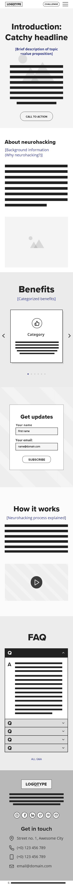
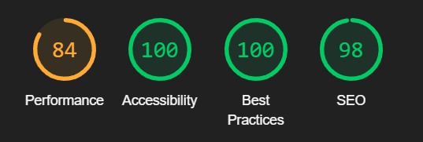

# **NeuroNova Neurohacking**
## **Site Overview**
NeuroNova is an initiative in the realm of cognitive enhancement. We want to provide individuals with knowledge, tools and techniques to unlock their brain's full potential. Our site is intended to target individuals who are keen on personal growth and cognitive advancement, but also be appealing to professionals as well as students, and anyone curious about the vast capabilities of the human mind. 
​

​
## Table of contents:
1. [**Site Overview**](#site-overview)
1. [**Planning stage**](#planning-stage)
    * [***Target Audiences***](#target-audiences)
    * [***User Stories***](#user-stories)
    * [***Site Aims***](#site-aims)
    * [***Wireframes***](#wireframes)
    * [***Colour Scheme***](#colour-scheme)
    * [***Typography***](#typography)
1. [**Current Features**](#current-features)
    * [***Header/navigation bar***](#header)
    * [***Footer***](#footer)
1. [**Future-Enhancements**](#future-enhancements)
1. [**Testing Phase**](#testing-phase)
1. [**Deployment**](#deployment)
1. [**Tech**](#tech)
1. [**Credits**](#credits)
    * [**Honourable mentions**](#honourable-mentions)
    * [**General reference**](#general-reference)
    * [**Content**](#content)
    * [**Media**](#media)
​
## **Planning stage**
### **Target Audiences:**
* Users interested in understanding and learning more about neurohacking and its benefits.
* Users interested in enhancing their cognitive abilities.
* Users interested in personal growth, self-awareness, and achieving a deeper understanding of their mind.
* Users interested in leveraging cutting-edge research and techniques for mental well-being and optimization.
​
### **User Stories:**
* As a user, I want to see what the site's topic is.
* As a user, I want to be able to navigate on the site.
* As a user, I want to learn more about and understand what neurohacking is.
* As a user, I want to be able to contact the site.
​
### **Site Aims:**
* To inform users on how beneficial and broad neurohacking can be.
* To educate users on how they can use neurohacking to improve certain areas.
* To offer the users support and guidance through their neurohacking journey.
​
​
### **Wireframes:**
#### ​Desktop
 

#### Tablet
 

#### Mobile

​
### **Colour Scheme:**
We wanted ​the site to feel futuristic and make the user feel like their encounter with something innovative and cool. Since we focus a lot on personal development and self-improvement our chosen colours which represent that. 

​

Our main colour is green (#00C853), it used to be associated with something fresh, innovation and growth. 
We also have to kinds of blue accent colours, one lighter shade (#00E5FF) and one dark shade (#1A237E). Blue colours make people feel trust and bring calm. The lighter one is also a fresh, innovative and clear colour which is very visible, because of that we have chosen not to use it too frequently, only for details, so the user thinks the site is a pain to visit. The darker shade symbolises depth and is a bit mysterious, which also suits NeuroNova good because neurohacking is a quite unexplored area for most people. 
We have also a light (#F5F5F5) and a dark shade (F212121) to make it easier to match colours in back- and foreground in a harmonic and pleasant way. 

We decided to change the use for the colours and focus on a darker background and lighter colours for body text and headings, because we thought it would align more with the site's purpose and feeling and thought we want our users to have.

​
## **Typography**
​​
* Throughout the page, there are two fonts used:
  * [Proxima Nova](https://fonts.adobe.com/fonts/proxima-nova) - Font-weight bold - used for headings, navigation and buttons. Buttons and navigation have uppercase applied as a text transform to make them pop compared to other text.
  * [Open Sans](https://fonts.adobe.com/fonts/open-sans) - For the rest of the element, such as body text and our form. 
​
* Proxima Nova and Open Sans are a great font pair, proxima as a tougher, bold font which open sans smooth can work together with without being too much.
* All fonts were sourced from Adobe fonts through a link to the web type-kit we have created, which is linked under [Content](#content)
​
## **Current Features**
### *Header section:*
* Navigation: The header element contains the site navigation which provides direct links to each section of the page, ensuring users can quickly jump to the content they're interested in.
* Sticky navigation: Let the user easily navigate around the page without having to scroll to the top each time. 
* Clear Presentation: Each navigation option is presented in a clear, readable font and style, ensuring users can easily identify where they want to go.
* Site icon: Helps users instantly recognize and identify the brand. 

​​

* Mobile Optimization: For users on smaller screens who have limited real estate, a hamburger menu is provided. 
* Hamburger menu: Help to keep the design clean and organised. All the navigation options are neatly tucked away, and users can access them with a simple tap. This prevents the interface from looking cluttered.

​​

* Dropdown: Provide a clear and concise way for users to find what they're looking for without needing to scroll the whole page.

​​

### *Hero section:*
The first thing users see when they visit the site. It sets the tone and introduces them to the concept of neurohacking.

* Engaging Visuals: The hero section features captivating visuals that draw users in and pique their interest in neurohacking.
* Clear Call to Action: A clear and compelling call to action encourages users to learn more or take the next step in their neurohacking journey.

​​

### *About section:*
Delves into the concept of neurohacking, providing users with a comprehensive overview.

* Informative Content: Users are presented with well-researched and easy-to-understand information about neurohacking.
* Engaging Layout: Short and concise content is laid out in a way that's engaging and easy to digest.

### *Benefits section:*
Showcases the numerous advantages and positive outcomes of engaging in neurohacking.

* Headline Cards: Nine headline cards clearly and concisely list out the benefits of neurohacking, providing users with quick and digestible information.
* Visually Appealing Design: The cards are designed in an appealing manner that draws the user's attention and helps to effectively communicate the benefits.

### *How neurohacking works section:*
Provides an in-depth explanation of the neurohacking process.

* Engaging Video: A comprehensive video demonstrates and explains the neurohacking process, giving users a clear and engaging visual representation.
* Informative Text: Accompanying text provides additional context and information, ensuring users have all the knowledge they need to understand how neurohacking works.

### *FAQ - Frequently Asked Question*
Addresses common queries that users may have about neurohacking, enhancing their understanding and clarity.

Accordion Questions: Ten accordion-style questions that users can click to expand and reveal the answers, making it easy for them to find the specific information they're seeking without being overwhelmed by text.
Clear and Concise Answers: Each answer is articulate, concise, and easy to comprehend, providing users with the precise information they need.

### *Subscribe form*
Subscribe form allows users to receive updates and information about neurohacking.

* Required Fields: Users are required to fill out certain fields, ensuring the necessary information is collected for subscription.
* User-Friendly Design: The form is designed in a user-friendly manner, making it easy for users to subscribe.

#### *Thank you page*
After subscribing, users are taken to a thank you page that expresses gratitude for their interest.

* Heading "Thank You": A clear and prominent heading thanks users for subscribing.
* Button "Back to Site": A button allows users to easily navigate back to the site, continuing their journey with the brand.

### *Footer*
The footer provides users with additional information and links about the brand and neurohacking.

* Logotype: The brand's logotype is prominently displayed, providing users with instant brand recognition.
* Summary of Neurohacking: A brief summary of neurohacking is provided, giving users a quick overview of the concept.
* Linked Social Media Icons: Icons link to the brand's social media pages, allowing users to easily connect with the brand on social media.
* Contact Information: Contact information is provided, giving users a way to reach out to the brand with any questions or inquiries.
* Copyright: The copyright information is clearly displayed, protecting the brand's content.

​
## **Future-Enhancements**
​
A website is always evolving, and there are plans to further enhance the neurohacking site to provide an even better user experience.

* Email Integration: At the time of creating this page, there was no capability to send emails from the contact form. In the future, integrating with services like email.js will allow users to send emails directly from the site, enhancing the user experience.

* Interactive JS Game: Given the intriguing subject matter of neurohacking, there's a plan to include a small JavaScript-based game. This will engage users further, providing both entertainment and education about neurohacking concepts.

​
## **Testing Phase**
To test the games responsiveness and functionality we have performed different types of manual testing on a variety of browsers and devices, all described below. 
The [bugs](#bugs) we found are described under bugs with an explanation of our solutions.
​​
### **Manual testing**
#### **Browsers used for testing**
* Google Chrome
* Mozilla Firefox
* Microsoft Edge

### **Responsiveness**
We have tested the responsiveness of the site in several browsers and devices, listed above, to ensure cross-compatibility which will provide the expected user experience. Responsiveness has been tested using DevTools for each browser, both on chosen dimensions and by making the window smaller.

We have tested the sites responsiveness with Dev Tools in the following ways:
1. Live simulation of the site through VS Code.
2. Published page on GitHub. 

Ways we have used Dev Tools to test responsiveness:
1. Narrowed the screen when opening Dev Tools.
2. Checked different devices and dimensions.

# **Different devices**
We have also tested the website manually on different devices to check the responsiveness. 
The devices we have used are:
1. Monitors
    * 2560x1440 px
    * 2560 x 1080 px
2. Mobile phones
    * Samsung Galaxy S22 Ultra
    * Samsung Galaxy A54
3. Tablet 
    * Ipad Air

### **Functionality:**
During the manual testing we also tested the website's functionality so the users get what they expect visiting our website.

We have tested the sites functionality with Dev Tools in the following ways:
1. Live simulation of the site through VS Code.
2. Published page on GitHub. 

Ways we have used Dev Tools to test functionality:
1. Navigation
    * **Expected:** When the user clicks one of the links, the navigation should take the user to that section of the page. 
    * **Testing:** We tested the navigation by clicking all links in the navigation on both desktop and mobile devices. The tests were performed on different sections of the page to see that the functionality was not bound to a specific part of the page e.g. top.
    * **Result:** Works as expected.

2. Sticky header
    * **Expected:** The header should stick to the top of the page when the user is scrolling down. 
    * **Testing:** Scrolling up and down the page on both desktop and mobile devices to ensure the header follows.
    * **Result:** Works as expected.

3. Dropdown
    * **Expected:** When the user clicks the hamburger menu on smaller devices, the dropdown should appear. If the dropdown is visible, it should disappear when the user clicks the x.
    * **Testing:** Clicked the hamburger menu on smaller devices and the x when the dropdown is visible.
    * **Result:** Works as expected.

4. Call to action-button on hero section
    * **Expected:** When the user clicks the call to action, the site should scroll down to the subscription form.
    * **Testing:** Clicked the call to action button on both desktop and mobile devices.
    * **Result:** Works as expected.

5. Validation subscription form
    * **Expected:** If the user does not fill the form correctly, the form should tell the user to fill the form correctly.
    * **Testing:** Tested to send an empty form, tested to fill only one field at once, tested to not fill an email address, testet to not accept terms.
    * **Result:** Works as expected, the form is invalid and a message appears to the user.

6. Redirect to Thank You page
    * **Expected:** When the user subscribes, the user should get redirected to a Thank You page.
    * **Testing:** Tested to send the form on both desktop and mobile devices. 
    * **Result:** Works as expected.

7. Back to site button on Thank You page
    * **Expected:** When a button is clicked, it should redirect the user back to the home page.
    * **Testing:** Tested to click the "back to site" button on both desktop and mobile devices.
    * **Result:** Works as expected.

8. Accordion in FAQ
    * **Expected:** When a user clicks a question in the accordion in the FAQ, the answer should appear below.
    * **Testing:** Tested to click all accordions in the FAQ, both on desktop and mobile.
    * **Result:** Works as expected.

## **Validators:**
# **CSS** - https://jigsaw.w3.org/css-validator/ 
No errors were found.

No errors were found.

We got three warnings regarding the `webkit-animations` for the FAQ, this is not something we are going to solve at this moment since the animations are providing a nice experience for the user. 

# **HTML** - https://validator.w3.org/nu/ 
No errors were found.

No errors were found.

## **Lighthouse score**
​We also tested the site in Lighthouse. 
* The tests were performed in incognito mode to get more accurate results.
* We tested both desktop and mobile.

# **Desktop**
Overall a good score both on desktop and mobile.

## **Improvements to be made:**
### Performance - 97/100
* Eliminate render-blocking resources: 
We understand the importance of eliminating render-blocking resources to improve website loading times and user experience. However, our website is hosted on a GitHub server, which limits our control over server configurations and resource handling. This restriction makes it challenging to fully address the issue. Nonetheless, we are actively exploring possible solutions and improvements within the constraints of the GitHub server environment.

* Serve images in modern formats
After careful consideration and testing, we have decided not to implement next-gen formats for our website's background images. Our findings indicate that the use of next-gen formats in this particular case does not improve, and in fact, hinders our website's performance, leading to a suboptimal user experience. We believe that the potential benefits of next-gen formats are outweighed by the drawbacks in this specific scenario. However, it's important to note that we have implemented a fallback system for our HTML images, ensuring that they are served in next-gen formats when supported by the browser. This approach allows us to leverage the advantages of next-gen formats where applicable, while maintaining optimal performance and user experience for our background images.

# **Mobile**

#### **Performance** 84/100
* Eliminate render-blocking resources
Explained above. 

* Serve images in modern formats
Explained above.

#### **SEO** 97/100
* Tap targets are not sized appropriately
After thorough testing and consideration, we have decided not to address the "tap targets are not sized appropriately" issue. Our decision is based on the results of our extensive testing on mobile devices, which showed that users do not experience any difficulties interacting with the element in question. We believe that our user interface is already optimized for a seamless and user-friendly experience on mobile devices. As a result, we have concluded that resolving this specific issue is not necessary at this time.

## **Bugs**
During the project a lot of bugs appeared during development and deployment. We believe we have solved most of the issues that occured to get a functional website. 

**Overflow on smaller screens**
* **Issue** - On smaller screens it was possible to scroll horizontally. We could see this during our manual testing. 
* **Cause** - The FAQs styling was not optimised enough and made it go out of the screen. 
* **Solution** - Changed width to auto for screens 720px or below, which solved the problem.  

**Non-visible images**
* **Issue:** - During development and after deployment we noticed that images in the directory would not appear on the website.
* **Cause:** - The path to some of the images was not relative, making them non-visible on Github pages. 
* **Solution** - By changing all images and making new paths the images work as expected.
​
***
## **Deployment**
I deployed the page on GitHub pages via the following procedure: -
​
1. From the project's [repository](https://github.com/NatashaRy/neurohacking), go to the **Settings** tab.
2. From the left-hand menu, select the **Pages** tab.
3. Under the **Source** section, select the **Main** branch from the drop-down menu and click **Save**.
4. A message will be displayed to indicate a successful deployment to GitHub pages and provide the live link.
​
You  can find the live site via the following URL - [live webpage](https://natashary.github.io/neurohacking/)
***
​
## **Tech**
​
The technologies used in this project are:
​
- HTML
- CSS
​
## **Credits**
### **Honourable mentions**
​
**Richard Wells**
Your unwavering support throughout this project has been the beacon that guided me through challenges and uncertainties. Your wisdom, patience, and genuine belief in my potential have not only enriched my professional journey but have also instilled a confidence in me that I never knew I had. Your mentorship goes beyond mere guidance; it's a testament to the kind of remarkable person you are. I am profoundly grateful for every lesson, every piece of advice, and every moment of encouragement. Thank you for being an incredible mentor and for playing such a pivotal role in my growth.

**Johanna Bergsro**
In the intricate dance of professional life, having someone who consistently has your back is a rare and invaluable gift. Your unwavering support, your readiness to assist, and your genuine camaraderie have made every challenge more surmountable and every victory sweeter. It's not just your help that I am grateful for, but the trust and friendship that underpin it. Knowing that I can count on you has given me strength on the toughest days. Thank you for being more than just a colleague; thank you for being a true friend. Your presence has made all the difference.
​
### **Content:**

- All code was written by me, some code is inspired by others who are referenced below.
- Used this guide as inspiration for FAQ: [Stechies.com](https://www.stechies.com/create-accordion-html-without-javascript/)
- The texts are written by or modified by [ChatGPT](https://chat.openai.com/)

  
### **Media:**

- Favicon created with [Favicon.io](https://favicon.io/)
- Logotype and icon created in [Canva PRO](https://canva.com/)
- Icons was taken from [Fontawesome](https://fontawesome.com/)
- Images compressed with [TinyPNG](https://tinypng.com/)
- Screenshot for README.md [Am I Responsive](https://ui.dev/amiresponsive)
- Color palette, typography and wireframes were created in [Adobe XD](https://adobexdplatform.com/)
- Video on "How it works"-section was created with [Chat GPT4 + Visla-plugin](https://chat.openai.com/)
- All images are generated in [Adobe Firefly](https://firefly.adobe.com/)